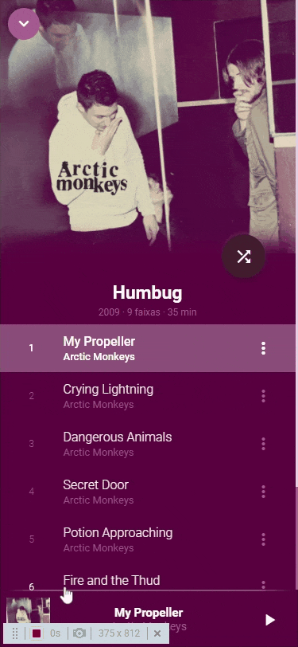

<h1 align="center">Áudio Player JS</h1>

 <a href="#objetivo">Objetivo</a> •
 <a href="#preview">Preview</a> •
 <a href="#funcionalidades">Funcionalidades</a> • 
 <a href="#tecnologias">Tecnologias utilizadas</a> • 
 <a href="#instalacao">Instalação</a> • 
 <a href="#autor">Autor</a>

<h3 id="objetivo">🔖 Objetivo</h3>

🚀 Projeto desenvolvido para fins de aprendizado de como fazer todo o controle de áudio apenas com Javascript puro.

<h3 id="preview">🖥️ Preview do projeto</h3>

  
  
  
  
  

<h3 id="funcionalidades">✅ Funcionalidades</h3>

- [x] Listagem das músicas.
- [x] Seleciona uma música ao clicar em alguma da lista.
- [x] Exibe resumo da música selecionada e seu estado.
- [x] Abre um player com todos os controles.
- [x] Toca próxima música ao finalizar a atual.
- [x] Toca uma música aleatória.
- [x] Repete música atual.
- [x] Exibe a letra da música.
- [x] Aumenta/Diminui o áudio.
- [x] Torna mudo.
- [x] Responsivo.
- [ ] Exibir total de duração em minutos da lista.
- [ ] Exibir total de faixas da lista.
- [ ] Criar backend para pegar metadados do mp3.

<h3 id="instalacao">🎲 Rodando o projeto</h3>

#### Pré-requisitos

Antes de começar, você vai precisar ter instalado em sua máquina as seguintes ferramentas:
[Git](https://git-scm.com), [Node.js](https://nodejs.org/en/).

#### Clone este repositório

`$ git clone <https://github.com/eriick505/audio-player-js>`

#### Acesse a pasta do projeto no terminal/cmd

`$ cd audio-player-js`

#### Execute a aplicação com um server de sua preferencia.

<h3 id="tecnologias">⚡ Tecnologias utilizadas</h3>

- Javascript puro
- CSS (Sass)
- Html

<h3 id="autor">😄 Autor</h3>

Desenvolvido por <a href="https://github.com/eriick505/"><b>Erick Santos</b></a>  
  👋🏽 Entre em contato!

 

